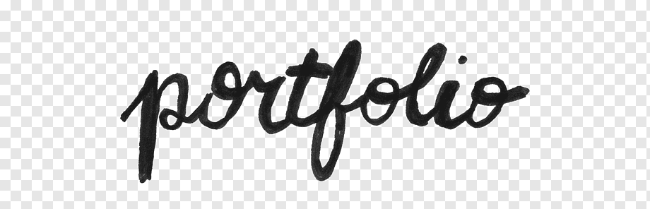

### <span style="color:gray">Hi there</span> 👋🏻
<!--
**sjahnsj/sjahnsj** is a ✨ _special_ ✨ repository because its `README.md` (this file) appears on your GitHub profile.

Here are some ideas to get you started:

- 🔭 I’m currently working on ...
- 🌱 I’m currently learning ...
- 👯 I’m looking to collaborate on ...
- 🤔 I’m looking for help with ...
- 💬 Ask me about ...
- 📫 How to reach me: ...
- 😄 Pronouns: ...
- ⚡ Fun fact: ...


<br>
-->

<div style="display:flex; flex-flow:wrap; justify-content:space-around; align-items:center">


<div style="padding:10px; background-color:#F6F8FA; margin-top:25px">
<div style="font-size:35px; font-weight:bold; text-align:center; color: #488bb8">
안녕하세요&nbsp; 안승진 입니다
</div>
<div >
<a style="font-size:20px; font-weight:bold; color:gray;" href="mailto:sjahnsj@gmail.com">📧 E-mail</a> <br>
<a style="color:gray;" href="mailto:sjahnsj@gmail.com">sjahnsj@gmail.com</a> <br>
<a style="color:gray;" href="https://github.com/sjahnsj"></a> <br>
<a style="color:gray;" href="https://github.com/sjahnsj">github.com/sjahnsj</a> <br>
<a style="color:gray;" href="./portfolio.html"></a> <br>
<a style="color:gray;" href="./portfolio.html">포트폴리오 보기</a> <br>


</div>
</div>
</div>


### 💻 <span style="color:gray">Tech Stack</span>
<div style="background-color:#F6F8FA; padding:15px">
<p>


</p>
</div>

### 🔨 <span style="color:gray">Tool</span>  
<div style="background-color:#F6F8FA; padding:15px">
<p>


</p>
</div>

### 🧑🏻‍💻 <span style="color:gray">Profile</span>

```
// Object of mySelf is to work together
mySelf = {
  name : "안승진",
  place : "서울",
  degree : {
    bachelors : "Electrical Engineering",
    masters : "Computer Engineering"
  },
  career : ["Computer and Mobile development", "Prduct Planning", "Procurement", "Business planning"],
  company : ["SamSung Electronincs", "SKTelecom", "Pantech", "Ajentech", "Hironic"],
  favoriteActivty : [()=>console.log("Coding"), ()=>console.log("Swimming"),
                     ()=>console.log("Binge Watching"), ()=>console.log("Eating")]
}
```

### 📚 <span style="color:gray">Portfolio</span>
**_[<span style="font-size:20px; background-color:black; color:orange;"> &nbsp;포트폴리오 보기 &nbsp; </span>](./portfolio.html)_**  


